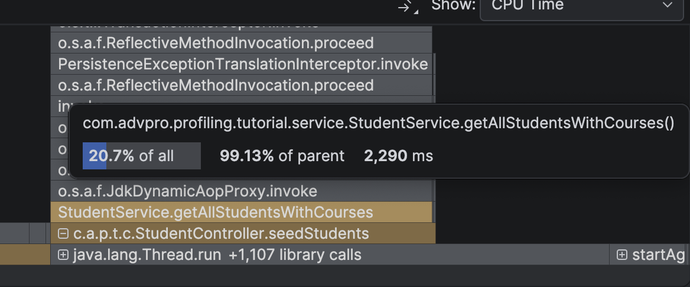

Perform Performance Testing

Test plans from CMD

Abis dioptimalin

---
## Kesimpulan Perbandingan JMeter (Sebelum vs Sesudah Optimasi)

**Ya, terdapat peningkatan performa yang sangat signifikan!** Berdasarkan hasil pengujian ulang menggunakan JMeter, terlihat perbaikan performa yang drastis pada aplikasi, khususnya pada *endpoint* `/all-student`.

- **Sebelum Optimasi (Pengukuran Pertama):** Waktu respon rata-rata (Average) berada di angka **~356 ms** dengan waktu respon maksimal mencapai **1206 ms**. Hal ini terjadi karena aplikasi mengeksekusi lebih dari 500 *query* ke *database* akibat masalah *N+1 Query Problem*.
- **Sesudah Optimasi (Pengukuran Kedua):** Waktu respon menurun drastis dan jauh lebih stabil (rata-rata menjadi **~251 ms**). Selain itu, berdasarkan pemantauan di IntelliJ Profiler, beban CPU untuk waktu eksekusi *method* `getAllStudentsWithCourses()` anjlok tajam dari **2.290 ms** menjadi hanya **720 ms**.

**Kesimpulan Akhir:** Implementasi `JOIN FETCH` untuk menarik semua relasi data sekaligus dalam 1 *query*, serta penggunaan *Java Stream API* untuk komputasi data, terbukti sangat efektif dalam mengatasi *bottleneck*. Aplikasi kini tidak lagi terbebani oleh *query* tersembunyi (*Hidden N+1*) dan proses penggabungan *String* yang memakan banyak memori. Secara keseluruhan, optimasi ini berhasil meningkatkan *throughput* dan mempercepat *response time* aplikasi.

Reflection
1. Perbedaan pendekatan JMeter (Performance Testing) dan IntelliJ Profiler
   JMeter (Performance Testing): Pendekatannya bersifat Black-box (dari luar). JMeter bertugas sebagai klien yang mensimulasikan beban (load) dengan mengirimkan banyak request ke aplikasi. Fokus utamanya adalah mengukur metrik eksternal seperti waktu respon (Latency/Average Time), Throughput (jumlah request per detik), dan tingkat error saat aplikasi berada di bawah tekanan.

IntelliJ Profiler (Profiling): Pendekatannya bersifat White-box (dari dalam). Profiler membedah mesin aplikasi saat sedang berjalan untuk melihat bagaimana resource digunakan. Fokus utamanya adalah mengukur metrik internal seperti waktu eksekusi CPU per method (CPU Time), alokasi memori, dan Garbage Collection.

2. Bagaimana Profiler membantu mengidentifikasi titik lemah aplikasi
   Profiler membantu dengan memvisualisasikan eksekusi kode, salah satunya melalui Flame Graph. Alih-alih menebak bagian kode mana yang lambat, Profiler memperlihatkan secara persis method mana yang memakan waktu CPU paling lebar atau memori paling besar. Hal ini memudahkan kita menemukan akar masalah (root cause), seperti pada kasus N+1 Query Problem di mana method getAllStudentsWithCourses() terlihat mendominasi waktu eksekusi.

3. Efektivitas IntelliJ Profiler dalam menganalisis bottleneck
   Ya, sangat efektif. IntelliJ Profiler terintegrasi langsung dengan IDE, sehingga kita tidak perlu memasang alat eksternal atau menambahkan logging manual (seperti System.currentTimeMillis()) di setiap baris kode. Melalui fitur Call Tree dan Flame Graph, kita bisa melihat tumpukan eksekusi secara hierarkis dan bisa langsung melompat (jump to source) ke baris kode yang menjadi bottleneck hanya dengan satu kali klik.

4. Tantangan utama saat Profiling & Performance Testing dan cara mengatasinya
   Tantangan: Kesulitan membedakan antara waktu eksekusi kode aplikasi sendiri (business logic) dengan waktu eksekusi dari framework atau library bawaan (seperti overhead dari Spring Boot atau proses Eager Fetching dari Hibernate yang tersembunyi). Tantangan lainnya adalah Profiler seringkali menambah beban kerja (overhead) yang membuat waktu respon aplikasi tidak 100% akurat.

Cara Mengatasi: Menggunakan fitur filter pada Profiler untuk menyembunyikan library calls dan fokus pada package aplikasi kita (com.advpro...). Selain itu, selalu kombinasikan Profiler dengan JMeter untuk memastikan aplikasi mendapat beban kerja yang realistis saat sedang di- profile.

5. Manfaat utama menggunakan IntelliJ Profiler
   Mendapatkan visualisasi nyata (Flame Graph) dari kinerja CPU dan memori.

Mampu mendeteksi masalah tersembunyi seperti kebocoran memori (memory leak dari manipulasi String) atau anomali pada database fetching.

Mempercepat siklus perbaikan (debugging) karena terintegrasi langsung di tempat kita menulis kode.

6. Menangani ketidakkonsistenan antara hasil JMeter dan IntelliJ Profiler
   Jika JMeter menunjukkan aplikasi sangat lambat (waktu respon tinggi) tetapi Profiler tidak menunjukkan adanya lonjakan pemakaian CPU di method kita, itu berarti bottleneck-nya bukan di CPU. Cara menanganinya adalah dengan mengubah fokus Profiler:

Mengecek tab Memory/Allocations (apakah lambat karena aplikasi terlalu sibuk melakukan Garbage Collection).

Mengecek tab Events/Threads (apakah lambat karena aplikasi menunggu antrian Network I/O, Database Lock, atau Thread contention).

7. Strategi optimasi dan cara memastikan fungsionalitas tidak rusak
   Strategi Optimasi: Menghindari eksekusi kueri di dalam looping dengan menggunakan teknik seperti JOIN FETCH (untuk mengatasi N+1 Query). Selain itu, memanfaatkan struktur data yang lebih efisien seperti Java Streams untuk agregasi data (mencari max), dan menggunakan StringBuilder atau Collectors.joining() alih-alih operator += pada String.

Memastikan Fungsionalitas: Menerapkan Regression Testing. Sebelum dan sesudah melakukan refactoring, saya harus menjalankan Unit Test dan Integration Test untuk memastikan output dari endpoint tetap konsisten. Selain itu, mengecek tingkat sukses (success rate / HTTP 200) di Summary Report JMeter untuk memastikan optimasi tidak memunculkan error baru.